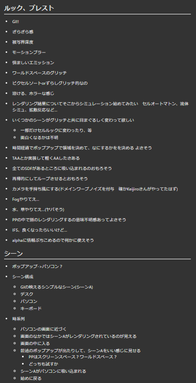

---

## はじめに

2023.4.28-30、ツインメッセ静岡で開催された[SESSIONS in C4 LAN 2023 SPRING](https://sessions.frontl1ne.net/)に参加しました。


SESSIONSについては以下のように説明されています。
> SESSIONS（セッションズ）は、C4 LAN 2023 SPRINGの会場および配信のハイブリッドで行われるデモパーティーです。 デモパーティーとはコンピューターを用いたプログラミングやアートに興味のある人々が日本中・世界中から一堂に会し、デモ作品のコンペティション (Compo) やセミナーなどが行われるイベントです。 パーティという名の通り、勉強会のように堅苦しい感じではなく、みんな賑やかに作品の制作過程を見せ合ったりと参加者同士でのコミュニケーションが盛んに行われます。

この通りSESSIONSはデモパーティーではありますが、デモ以外にも技術ベースのアプローチによって行われる創作作品(テクニカルクリエーション)全般が対象となっている、包括的なイベントになっています。\
日本での大きいデモパーティーが開かれるのは、2021年の[Tokyo Demo Fest 2021](https://tokyodemofest.jp/)から2年ぶりとなります。

私はSESSIONSのGLSL Graphics Compoに参加し、『POOL』という作品を提出しました。\
その結果、[優勝することが出来ました！](https://twitter.com/SESSIONS_Party/status/1652513515767488512)

<iframe width="560" height="315" src="https://www.youtube.com/embed/xTWGxKEn7jw" title="YouTube video player" frameborder="0" allow="accelerometer; autoplay; clipboard-write; encrypted-media; gyroscope; picture-in-picture; web-share" allowfullscreen></iframe>

<blockquote class="twitter-tweet"><p lang="ja" dir="ltr"><a href="https://twitter.com/hashtag/SESSIONS_Party?src=hash&amp;ref_src=twsrc%5Etfw">#SESSIONS_Party</a> <br>【POOL】<br>GLSL Graphics Compoで一位を頂いた作品です。<br><br>こちらは57409文字のコードだけで描かれており、Twiglというサイトで動くようにプログラムしました。<br>高画質版を見たい方はYoutubeの方をご覧ください。<a href="https://t.co/09QyiOT3aN">https://t.co/09QyiOT3aN</a> <a href="https://t.co/bJT59e54Qv">pic.twitter.com/bJT59e54Qv</a></p>&mdash; Renard (@Renardealer) <a href="https://twitter.com/Renardealer/status/1653021505356447746?ref_src=twsrc%5Etfw">May 1, 2023</a></blockquote> <script async src="https://platform.twitter.com/widgets.js" charset="utf-8"></script>

- [ShaderToy](shadertoy.com/view/Dtd3zX)

以下では、『POOL』の技術的な解説を行います。

## GLSL Graphics Compoについて

[GLSL Graphics Compoのレギュレーション](https://sessions.frontl1ne.net/#glsl-graphics-compo)の通り、[twigl](https://twigl.app/)というサイトで動くようにGLSLを書く必要があります。\
使える変数は
- time:経過時間
- frame:経過フレーム
- mouse:マウス位置
- resolution:画面解像度
- backbuffer:1フレーム前の画面

のみで、外部の情報を取得することは出来ません。

つまり、**GLSLのピクセルシェーダー**のみで作品を作る必要があります。

## 作品の構成

『POOL』は、57409文字で構成されています！\
この文字数は異常で、本番環境で一度クラッシュしたほどです。(すいませんでした...)

一応こちらに全文を載せておきます。\
[『POOL』のソースコード](https://gist.github.com/Forenard/7eb5a752759f4ce2863dd668ea8522cb)

## 『POOL』の解説

ここからは『POOL』の解説を行います。

と言っても、57409字を1から説明するととても長くなってしまうので、時系列でどの様に作ったのかを解説していきます。

---

### 2023/04/08 : SESSIONSを知る、レイマーチングの手法を勉強する

友達の[@Kinakomoti](https://twitter.com/Kinakomoti2357)から、SESSIONSの存在を知りました。

それまで私はつぶやきGLSLという「twiglで動くGLSLのコードをつぶやく」という事をやっていたので、twiglを使うGLSL Graphics Compoレギュレーションに参加しようと思いました。

SESSIONSの提出締め切りは2023/04/21なので、13日間で作品を作らなければなりません。\
また、文字制限なしの条件でレイマーチングで何かしらの作品を作った経験は無く、先ずはレイマーチングの手法を勉強する必要がありました。

[ShaderToy](https://www.shadertoy.com/)などの作品や、0b5vrさんの[「レイマーチング1から5」](https://scrapbox.io/0b5vr/%E3%83%AC%E3%82%A4%E3%83%9E%E3%83%BC%E3%83%81%E3%83%B3%E3%82%B01%E3%81%8B%E3%82%895)を見て勉強し、早速翌日から作業を始めました。

---

### 2023/04/09 : 『POOL』の構想、開発環境の構築、SDFモデリング

#### 『POOL』の構想
先ず制作するものの構想を練りました。

私は[Liminal Space](https://ja.wikipedia.org/wiki/%E3%83%AA%E3%83%9F%E3%83%8A%E3%83%AB%E3%82%B9%E3%83%9A%E3%83%BC%E3%82%B9)が好きなので、色々なLiminal Space的な作品を見て、そこからインスピレーションを得ました。\
その結果、プールの中にコンピュータがあるという構想に至りました。

また、mdや部内チャットツールに色々なアイデアをメモする癖があるので、やりたいことなど思いついた事を全てメモしていきました。



ごちゃごちゃしていますが、主なやりたいことは
- GI
- パソコンの画面の表現
- プールの水の表現

です。

結局できたシーンはこの頃の構想とは違いますが、根柢のコンセプトは変わっていません。

#### 開発環境の構築

最終目的はtwiglで動くGLSLのコードを書く事ですが、twiglでコードを書くと
- デバッグがしにくい
- コンパイルしたくないときにも自動でコンパイルされてしまう
- コンパイルの最中、ブラウザの別タブが動かなくなる

などの問題があります。\
ですので、[gamさんの記事](https://gam0022.net/blog/2018/12/24/vscode-glslsandbox)を参考に、VSCode上でGLSLを書く環境を構築しました。

詳しくはそちらを見て頂ければと思いますが、それに加えて私は
- [WebGL GLSL Editor - Visual Studio Marketplace](https://marketplace.visualstudio.com/items?itemName=raczzalan.webgl-glsl-editor)

という拡張機能をいれています。こちらはコードの補完やシンタックスハイライトを行ってくれます。

#### SDFモデリング

シーンを作るにあたってSDFによるモデリングを行う必要があります。\
私はUnity上でRaymarchingが簡単にできる[uRaymarching](https://github.com/hecomi/uRaymarching)を用いて、Editor上で見え方を確認しながらモデリングを行いました。

(部内チャットのログ)


この時点で部屋の大体の形が決まりました。

---

### 2023/04/10 : レイトレーサーの実装

#### Madtracerの改造

シーンの概形ができたので、次にレイトレーサーの実装に取り掛かりました。

GIを表現できなければいけないので、最初は[Virgillさん](https://twitter.com/Virgill74)の開発したMadtracerを使おうと思いました。\
こちらは、[TDF2021のgamさんの優勝作品](https://gam0022.net/blog/2021/12/20/tdf2021-glsl)でも使われた手法で
- 反射光の表現(金属のみをサポート)
- EmissionによりBloomの表現ができる
- Roughnessの設定もできる

という、とても良い手法です。これを少し書き換えて実装しました。

```glsl
void madTracer(vec3 ro0, vec3 rd0, in float seed)
{
    ScreenColor = vec3(0.0);
    float len0 = 0.0, len1 = 0.0, dist1 = 0.0;
    vec3 ro1, rd1, nor1, rp;
    MapInfo info0 = MapInfo(), info1;
    float weight = 0.0, weightSum = 0.0;
    for(int i = min(iFrame,0); i < LoopMax; i++)
    {
        if(DistMin < info0.dist)
        {
            rp = ro0 + rd0 * len0;
            info0 = map(rp);
            len0 += mix(abs(info0.dist) + 0.0032, info0.dist, info0.mat);
            ro1 = ro0 + rd0 * len0;
            nor1 = normal(ro1) * 1.0001;
        }
        rd1 = mix(reflect(rd0, nor1), hashHs(nor1, vec3(seed, i, LocalTime)), info0.roughness);
        info1 = map(ro1 + rd1 * len1);
        dist1 = 0.25 * mix(abs(info1.dist), info1.dist, info1.mat);
        len1 += dist1;
        weight = weightFunc(dist1);
        weightSum += weight;
        ScreenColor += weight * (info1.color * info1.emission + info0.color * info0.emission);
    }
    ScreenColor /= weightSum;
}
```
ちなみにこの時点でmap関数の返り値は以下の様に定義しています。(後にある出来事があり、この定義は変更されます。)
```glsl
struct MapInfo
{
    float dist;// SDFの距離
    int mat;// マテリアルの種類(Unlit,Metaricなど)
    float roughness;
    float metalic;
    float emission;
    float lightRange;// 光源の半径
    float lightPower;// 光源の強さ pow(hoge,lightPower)
    vec3 shadow;// 影の色
    vec3 color;// Albedo
};
```

変更した点としては
- 計算量の削減
- アーティファクトの減少

の二点です。

元のMadtracerでは
```glsl
Loop(N)
{
    // プライマリレイを進める
    map();
    // プライマリレイの衝突点からNormalを計算
    normal();
    // 計算したNormalに沿ってセカンダリレイを進める
    map();
}
```
のような実装で、mapがN*6回呼ばれていたので、これを
```glsl
Loop(N)
{
    if(衝突する前)
    {
        // プライマリレイを進める
        map();
        // プライマリレイの衝突点からNormalを計算
        normal();
    }
    // 計算したNormalに沿ってセカンダリレイを進める
    map();
}
```
のように変更しました。\
これで計算量を`N*6 -> M*6+N`に削減できました。(Mは衝突する前のループ回数)

また、Bloomの表現でアーティファクトが出ていた問題は、重みづけをすることで解消出来ました。

**しかしこれでもmap関数の呼び出しが多く、私のようなこまごまとしたシーンで使うには重すぎたので、使用は断念しました...**

#### 自作レイトレーサーの実装

ステップ毎にNormalを計算するのはとても重いので、衝突点からセカンダリレイを飛ばして反射光を計算する方法に切り替えました。\
レイのサンプル数は1なのでノイズが目立ちますが、[TAA](https://hikita12312.hatenablog.com/entry/2018/07/22/193610)みたいな事をするとそこそこ綺麗になりました。

TAAみたいなことは、以下の様に実装できます
```glsl
// UVをランダムに少しずらす
vec2 aa =hash23(vec3(LocalTime, fragCoord)) - 0.5;
vec2 p = (2.0 * (fragCoord.xy + aa) - iResolution.xy) / max(iResolution.x, iResolution.y);

// ---------------------------------------------------------------------------------------
// some code
// ---------------------------------------------------------------------------------------

// backbufferと合成する
vec3 bac = BackBuffer(uv).rgb;
fragColor.rgb = clamp(bac * 0.5 + fragColor.rgb * 0.5, 0., 1.);
```

この時点での絵はこんな感じです


---

### 2023/04/10 : ディフューズ、影の追加

このままでは金属以外の表現ができないので、ディフューズを実装する必要があります。

個人的に以下のようなものが欲しいという気持ちがあります
- 場所によってEmissionの色が違う & SDFで形状が指定できるライト
- そのライトによる影

今回はパソコンの画面も光源として扱いたいので、「場所によってEmissionの色が違う」という事ができるようにしたいです。

つまり下の画像の様に、パソコンの画面という一つの光源だけで影、ディフューズ、反射を表現したいという事です。(この画像は提出した作品です)


しかし、上記の条件を満たすようなライトの実装は調べても出てきませんでした。(知っている方は教えていただけると嬉しいです)

結果的にライトは実装出来ました。(勝手にApporximateLightと呼んでいます)\
簡単に説明すると、[NEE](https://kinakomoti321.hatenablog.com/entry/2021/12/23/035027)のようなことをしています。
```glsl
apporximateLight()
{
    // ライトの強さ
    float attenuation = 0.0;
    Loop(N)
    {
        // ライトの方にレイの方向を曲げる
        dir = -lightNormal(rp);
        // ランダムにレイの方向をずらす
        dir = randomize(dir);
        // レイを進める
        dist = lightMap(rp);
        rp += dir * dist;
        // ライトの寄与を計算
        attenuation += lightAttenuation(dist);
    }
    // ライトの強さを正規化
    attenuation /= float(N);
}
```

影についてはApporximateLightで得られたライトSDFへの衝突点と方向を使い、もう一度レイを飛ばすことで遮蔽を計算しています。

また、全てのSDFライトをminなどで一つのSDFに合成してしまうと、ライトの色の境界がはっきりしてしまう問題があります。


これを避けるために、ApporximateLightはSDFライト1つにつき1回呼び出すようにしています。\
そうすることで、複数のライトの色を加算合成できます。


ApporximateLightの内容を説明すると長くなってしまうため、詳細は後々ブログに纏める予定です。

**この時点で30000文字を越えています...**

---

### 2023/04/12 : フォグ、PCから伸びる配線の追加

フォグを実装しました。\
これは普通のVolumeRenderingをしています。


PCから伸びる配線は、この様な感じで実装しました。


この様な見た目になりました。


**この時点で40000文字を越えています...**

---

### 2023/04/13 : 配線のEmissionを動かす

配線のEmissionを動かすことで、何かが流れている感じを出しました。


ノイズが目立っているのはApporximateLightの影響です。

---

### 2023/04/14 : 水面の追加

Reflection/Refractionのある水を実装しました。\
なんとなくCausticsも入ってます(ほぼ分かりませんが)

Causticsは[webgl-water](https://medium.com/@evanwallace/rendering-realtime-caustics-in-webgl-2a99a29a0b2c)の実装と同じです


---

### 2023/04/15 : デバッグ用の機能の追加、マテリアルの設定

デバッグ用の機能を追加しました。
- WASDで動く
- マウスで視点を動かす
- カメラの方向、位置を表示する

これは、後々カメラの位置と方向を使ってカメラのシーケンスを作成するためです


また、床や蛍光灯、PCのスクリーンなどのマテリアルを実装しました。\
タイルは色をランダムに変え、DisplacementMapで凹凸をつけるとディテールが増して良い感じになりました。


**この時点でコンパイル時間が1分を超えました**

---

### 2023/04/16 : マテリアル、ライティングの調整

コンパイルを繰り返し、マテリアルやライティングの調整を行いました。

デスクの木のマテリアルはFBMを使いました
```glsl
float n = fract(fbm(p * vec3(2.0, 2.0, 0.5), 2.0) * 7.0) * 3.0;
int id = int(n);
float ca = fract(n);
vec3 c = mix(_deskCols[id], _deskCols[id + 1], ca);
```


ここからシーンを始めようかな、みたいなことも考えていました


ここまで順調だった開発ですが、ある問題が発生します...

<p style="color:red;"><b>コンパイルが通らなくなりました</b></p>


---

### 2023/04/17 : コンパイルが通らない問題の原因調査

まずはfor文のunrollが原因かと予想し、unrollを抑制するコードを試しました

(ShaderToyのどこかのフォーラム？で見たコードです)
```glsl
for(int i=min(frame,0);i<N;i++)// unroll抑制
{
    // 処理
    if(i<-1)break;// unroll抑制
}
```

しかし、これでもコンパイルが通りませんでした。

次に、コードの量が問題ではないかと考え、[Shader_Minifier](https://github.com/laurentlb/Shader_Minifier)を使ってコードを圧縮しました。\
しかしコンパイルは通りませんでした。

他にも
- 関数を手動でインライン展開する
- if文、三項演算子を可能な限りstep関数で置き換える
- 処理を消したりして、原因となるコードを特定する

などを行いましたが、全て効果はありませんでした...

(原因特定に苦戦している様子)


結局原因は分からず、この日は終わりました。

---

### 2023/04/18 : コンパイルが通らない問題の解決

先日に続いて原因となるコードを特定しようとしていましたが、コンパイルの可否に法則性が無く\
結局原因は分かりませんでした。


モチベーションも低下し、一旦開発から離れようと思いました。

---

### 2023/04/19 : 休憩

多分ゼノブレイド3とかをしていました

あとはレイマーチング1から5を見ていて[SDFのNN表現](https://youtu.be/8pwXpfi-0bU)が気になったので、明日やってみようかなという気持ちになっていました

---

### 2023/04/20 : SDFのNN表現のテスト、VHS風エフェクトの実装、コンパイルを通す

#### SDFのNN表現のテスト


自分としてはVaporwaveっぽい彫刻を期待したのですが
- 高周波成分が残らないため、彫刻っぽく見えない
- 重い

という問題があり、作品には含めませんでした。

#### VHS風エフェクトの実装


文字にはFlyguyさんの[Font](https://www.shadertoy.com/view/Mt2GWD)を使用しました。

#### コンパイルを通す

残念ですが、今まで実装したものをコンパイルが通るぎりぎりまで削りました\
削ったものは以下の4つです
- 水のReflection/Refraction
- Fog
- Bloom
- マテリアルの切り替え

また、今までは`map`の返り値を前述の`MapInfo`で返していましたが、これを`vec2`に変更しました。(SDFの距離、マテリアルのID)\
マテリアルの取得は
```glsl
// (p: 衝突点, fid: マテリアルのID)
MatInfo getMatInfo(vec3 p, float fid)
```
という関数を作り、SDFと分離しました。

これにより、今まで`map`を呼び出すたびに`MapInfo`を作成していたのを`vec2`だけに抑えることが出来ました。

**結果、なんとかコンパイルが通りました。**

---

### 2023/04/21 (最終日) : PCの画面作成、カメラのシーケンス作成

#### PCの画面作成

そういえばロゴを出していないなと思ったので、PCの画面にロゴを表示することにしました。


しゅっとした動きが欲しかったので、イージングをかけました


これは何となく思いついたのですが、結構良い感じになりました

#### カメラのシーケンス作成

デバッグ表示で得た複数のカメラの位置/向きを補間したいです\
補間方法は色々ありますが、今回は[Catmull–Rom spline](https://en.wikipedia.org/wiki/Cubic_Hermite_spline#Catmull%E2%80%93Rom_spline)を実装しました

```glsl
#define MAX_CATMULL_LENGTH 16
vec3 CATMULL_ROM_POINTS[MAX_CATMULL_LENGTH];
float CATMULL_ROM_LENGTH[MAX_CATMULL_LENGTH];

void setCatmull(int id, vec3 point)
{
    CATMULL_ROM_POINTS[id] = point;
    CATMULL_ROM_LENGTH[id] = (id > 0 ? (length(CATMULL_ROM_POINTS[id] - CATMULL_ROM_POINTS[id - 1]) + CATMULL_ROM_LENGTH[id - 1]) : 0.0);
}

vec3 getCatmull(int count, float t)
{
    t = clamp(t, 0.0, 1.0);
    float sl = CATMULL_ROM_LENGTH[count - 1];
    for(int i = 1; i < count; i++)
    {
        if(t * sl <= CATMULL_ROM_LENGTH[i])
        {
            t = clamp((t * sl - CATMULL_ROM_LENGTH[i - 1]) / (CATMULL_ROM_LENGTH[i] - CATMULL_ROM_LENGTH[i - 1]), 0.0, 1.0);
            if(i == 1)
            {
                vec3 p0 = CATMULL_ROM_POINTS[0];
                vec3 p1 = CATMULL_ROM_POINTS[1];
                vec3 p2 = CATMULL_ROM_POINTS[2];
                return 0.5 * ((p0 - 2.0 * p1 + p2) * t * t + (-3.0 * p0 + 4.0 * p1 - p2) * t + 2.0 * p0);
            }
            else if(i == count - 1)
            {
                vec3 p0 = CATMULL_ROM_POINTS[i - 2];
                vec3 p1 = CATMULL_ROM_POINTS[i - 1];
                vec3 p2 = CATMULL_ROM_POINTS[i];
                return 0.5 * ((p0 - 2.0 * p1 + p2) * t * t + (-p0 + p2) * t + 2.0 * p1);
            }
            else
            {
                vec3 p0 = CATMULL_ROM_POINTS[i - 2];
                vec3 p1 = CATMULL_ROM_POINTS[i - 1];
                vec3 p2 = CATMULL_ROM_POINTS[i];
                vec3 p3 = CATMULL_ROM_POINTS[i + 1];
                return 0.5 * ((-p0 + 3.0 * p1 - 3.0 * p2 + p3) * t * t * t + (2.0 * p0 - 5.0 * p1 + 4.0 * p2 - p3) * t * t + (-p0 + p2) * t + 2.0 * p1);
            }
        }
    }
}
```

全てのカメラワークをこれで実装しました。

また、タイムラインは以下のように実装しています
```glsl
// タイムラインの定義
float T = 0.0;
#define MAX_SCID 24
float SCID[MAX_SCID];
#define SCI01(id) if((T=(LocalTime-SCID[id-1])/(SCID[id]-SCID[id-1])),(SCID[id-1]<=LocalTime&&LocalTime<SCID[id]))

void Init()
{
    // キーフレームを打つ
    SCID[0] = 0.0;
    SCID[1] = 20.0;
    SCID[2] = 20.5;
    SCID[3] = 35.0;
    ...
}
```

これにより、カメラの動きの定義は以下の様にできます
```glsl
SCI01(1)
{
    float LT = pow(T, 0.5);
    // dir
    setCatmull(0, vec3(-.98387, -.17546, -.03472));
    setCatmull(1, vec3(-.88153, -.11387, .45818));
    setCatmull(2, vec3(-.8165, -.06842, .57326));
    setCatmull(3, vec3(-.76864, -.32789, .54924));
    setCatmull(4, vec3(-.43677, -.53729, .72147));
    dir = normalize(getCatmull(5, LT));
    // ro
    setCatmull(0, vec3(6.9117, .6681, -2.5893));
    setCatmull(1, vec3(6.9117, .6681, -5.0495));
    setCatmull(2, vec3(.7727, .9317, -4.8827));
    setCatmull(3, vec3(-3.6579, 3.2047, -3.5855));
    setCatmull(4, vec3(-5.5876, 3.1361, -2.239));
    ro = getCatmull(5, LT);
}
```

---

### 2023/04/22 : 完成、クラッシュの修正

#### 完成

締め切りの数分前に提出できました！


しかしその後、**本番環境でクラッシュしたとの連絡がありました:scream:**

#### クラッシュの修正

正直必死過ぎて覚えていませんが、以下のような修正を行いました
- 使っていない処理の削除
- ループ回数を減らす
- SDFの個数を減らす
- 三項演算子の置き換え
- 変数の数の削減
- マクロの数の削減

これらの修正により、なんとかクラッシュは回避できました。\
修正に付き合って頂いたオーガナイザーの方々には本当に感謝しています:pray:

---

## まとめ

途中で諦めてしまいそうになりましたが、なんとか完成できてとても嬉しかったです。

SESSIONSに参加していなければこんなにいろいろな知識を得ることはできなかったですし、ずっと憧れていた人達に会う事も無かったと思います。

またSESSIONSが開催されればぜひ参加したいです!

---

## おわりに

この記事で紹介したもの以外にも沢山の解説記事、コード、作品を参考にしています。\
例えば、この記事自体の構成も[gamさんの記事](https://gam0022.net/blog/2021/12/20/tdf2021-glsl)を参考にしています。\
私のような初学者が勉強するための道標を作ってくださった沢山の方々に深く感謝します。

また、SESSIONSのオーガナイザーの方々、参加者の方々、スポンサーの方々、その他関わった全ての方々に感謝します。本当にありがとうございました！

---

## 感想

今回ずっと苦しめられたコンパイルの問題ですが、gazさんより「OpenGLなら数秒でコンパイルができる」というアドバイスを頂きました。\
あと、音楽がないと寂しいので次回は64kデモなどにも挑戦したいなと思いました。

また、制作中は大体Kinakomotiさんと通話していたのでいい刺激になりました。\
作業通話、良いのでおすすめです。
