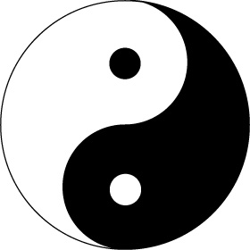

---

## 要約

- シェーダーでアイコンを描きました。
- 書き方はいろいろありますが、個人的に一番楽な方法を紹介します。

## はじめに

以前のアイコンに飽きたので、アイコンを描きました。

<blockquote class="twitter-tweet"><p lang="qme" dir="ltr"><a href="https://twitter.com/hashtag/%E6%96%B0%E3%81%97%E3%81%84%E3%83%97%E3%83%AD%E3%83%95%E3%82%A3%E3%83%BC%E3%83%AB%E7%94%BB%E5%83%8F?src=hash&amp;ref_src=twsrc%5Etfw">#新しいプロフィール画像</a> <a href="https://t.co/N7ZUMedpYm">pic.twitter.com/N7ZUMedpYm</a></p>&mdash; Renard (@Renardealer) <a href="https://twitter.com/Renardealer/status/1661305087174770688?ref_src=twsrc%5Etfw">May 24, 2023</a></blockquote> <script async src="https://platform.twitter.com/widgets.js" charset="utf-8"></script>

これはGLSLを書ける[Twigl](https://twigl.app/)というサイトで作りました。


ソースコードも一応貼っておきます。

[ソースコード(Twigl)](https://twigl.app?ol=true&ss=-NWDOSuLyOP4dZCkAaZo)

シェーダーで絵を描く方法はいろいろありますが、今回私はスマホで書いていたのでコードの速度や長さは気にしない最も楽な方法をとりました。

この記事ではそれを紹介します。\
(あくまで私が楽だと思う方法ですので、ご了承ください。)


## 描き方

1. uvを`[-1, 1] x [-1, 1]`の範囲にする
2. 描画の最終的な有無を`float c`で定義する
3. `c += float(ブール演算)`で図を追加する

以上です。

### 1. uvを`[-1, 1] x [-1, 1]`の範囲にする

描きたい図にも寄りますが、基本的には`[-1,1]`であると嬉しいです。

- 対称にするときに`abs`だけで可能
- 関数グラフとしてとらえやすい
- `[x,y] -> [r,θ]`の変換が楽で、変換後の値も扱いやすい

などの嬉しさが考えられます。

### 2. 描画の最終的な有無を`float c`で定義する

後述のブール演算と加算の処理によって、cは0か1以上の値をとります。\
この値を用いて「cが0の時」と「cが1以上の時」で処理を分けることが出来ます。

例えば色にするときには
```glsl
vec3 col=vec3(c);
```
などとすると、cが0の時は黒、cが1以上の時は白になります。

### 3. `c += float(ブール演算)`で図を追加する

GLSLでは`float(true)`は`1.0`、`float(false)`は`0.0`になります。

この方法の嬉しいところは、やはりブール演算が使えるところです。\
例えば
```glsl
c += float(any(lessThan(vec2(0.9),abs(uv))));
```
とすると、こんな感じになります。


直感的で嬉しいですね。

## 実際に描いてみる

陰陽太極図を描いてみましょう。

これです。



```glsl
#define PI acos(-1.)
#define INV (1.-2.*c)
float c=0.;
c+=float(uv.x>0.0);
c+=float(length(uv-vec2(0,0.5))<0.5);
c-=float(length(uv+vec2(0,0.5))<0.5);
c+=INV*float(length(uv-vec2(0,0.5))<0.1);
c+=INV*float(length(uv+vec2(0,0.5))<0.1);
c*=float(length(uv)<1.0);
col=vec3(c);
```

`*`とか`INV`などを使っていますが、これもブール演算として考えてください。
- `*`は`1.0`だけくりぬく
- `INV`は`1.0`の時だけ色を反転する

という感じです。

<video src="./2023-05-25/0.mp4" controls style='width: 100%;height: auto;'></video>

やはり直感的なので、使いやすいです。

## まとめ

図を描くときにはブール演算の使用を検討してみてはいかがでしょうか。

ただ、コードゴルフにはあまり向いていません(float()と書かなければいけないので)