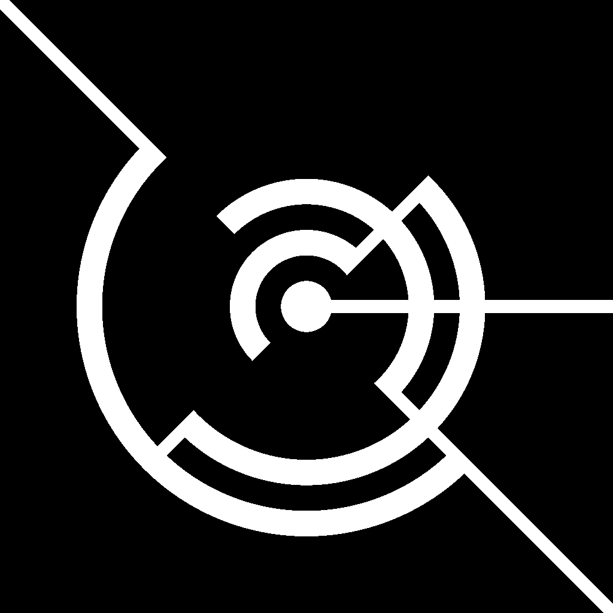

---

## Profile

<template>

  </src>
  

    

      
<b>Renard/レナード/ルナール</b>

    

    

      
Graphics Programmer Game Programmer

      
面白い表現が好き

    

  

</template>

## Contact

- [Twitter (main)](https://twitter.com/Renardealer) : メインアカウント
- [Twitter (sub)](https://twitter.com/Renard_VRC) : VRChat用アカウント
- [GitHub](https://github.com/Forenard) : ライブラリや様々なソースコードを公開しています
- [Qiita](https://qiita.com/Renard_Renard) : 技術記事を投稿しています

## Interest

- シェーダー開発
- VR上での表現
- ゲーム開発
- VJ

## Skill

- GLSL
- HLSL
- ShaderLab
- C#
- C++
- UdonSharp

## Affiliation

- 東京工業大学 工学院 情報通信系 : 学士課程 (2020/4-)

## Activities

- VJ at [lambda](https://twitter.com/ymgmcmc/status/1666401630651293696?s=20)
  - [映像](https://youtu.be/iVjLUrviE9I)

- [SESSIONS in C4 LAN 2023 SPRING](https://sessions.frontl1ne.net/) : GLSL Graphics Compo
  - [優勝](https://twitter.com/SESSIONS_Party/status/1652513515767488512)
  - [作品](https://www.youtube.com/watch?v=xTWGxKEn7jw)

- Silicon Studio Hackathon 2022『シェーダーで“非日常”を創り出そう』
  - 優勝

- CAPCOM Hackathon 2022
  - 優勝
  - [作品](https://forenard.github.io/ColumbusOfReiwa/) (chrome推奨)

- Unity Engine Challenge by mixi GROUP #3 (2022)
  - 準優勝

## Internship

- Silicon Studio : (2022/4-)

## Articles

- [Audacityで得られるGlitchいろいろ](https://qiita.com/Renard_Renard/items/e23de35854dd438297d2)
- [つぶやきGLSL　テクニック集](https://qiita.com/Renard_Renard/items/ba13b6590dfbcefa7156)
- [つぶやきGLSLとは (PWA Night vol.44の発表資料)](https://www.slideshare.net/GearsRenard/glslpptx-253677717)
- [【VRChat】自分のアバターにゲームを仕込んで暇潰ししよう](https://trap.jp/post/1743/)

