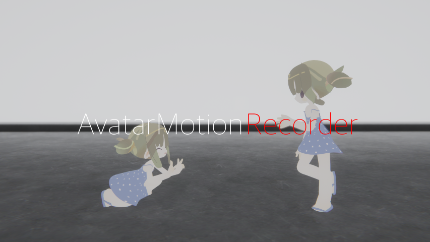
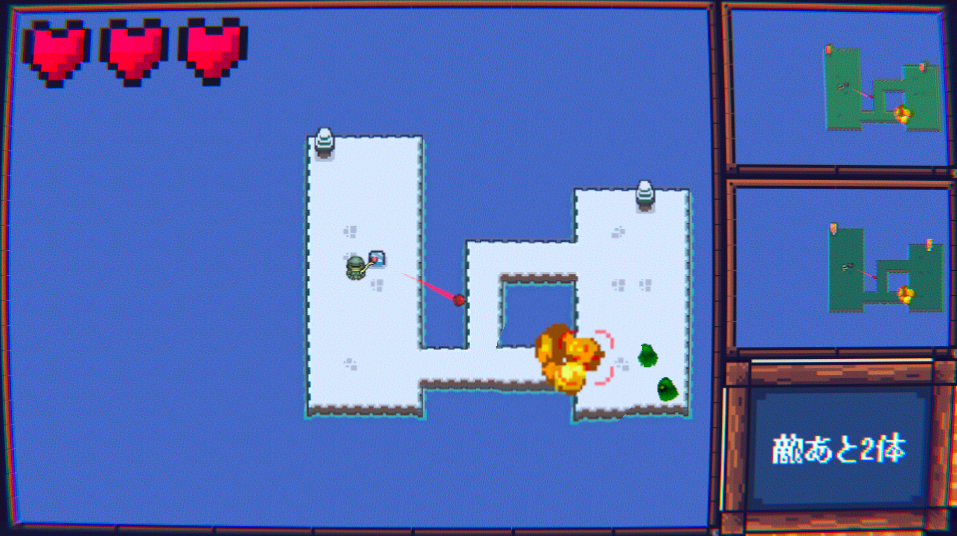

---
<template>
    

        <a href="https://x.com/Renard_VRC/status/1703392065332367395?s=20"><h2>まるい街</h2></a>
        
2023/09/17

        <blockquote class="twitter-tweet">
<a href="https://twitter.com/hashtag/VRChat_world%E7%B4%B9%E4%BB%8B?src=hash&amp;ref_src=twsrc%5Etfw">#VRChat_world紹介</a> <a href="https://twitter.com/hashtag/VRChat%E3%83%AF%E3%83%BC%E3%83%AB%E3%83%89%E7%B4%B9%E4%BB%8B?src=hash&amp;ref_src=twsrc%5Etfw">#VRChatワールド紹介</a> まるい街を作りました ぜひ<a href="https://t.co/rda3T7Zb4X">https://t.co/rda3T7Zb4X</a> <a href="https://t.co/1bZrvBagXG">pic.twitter.com/1bZrvBagXG</a>
&mdash; Renard_VRC (@Renard_VRC) <a href="https://twitter.com/Renard_VRC/status/1703392065332367395?ref_src=twsrc%5Etfw">September 17, 2023</a></blockquote> 
        

            
世界が歪むVRChatのワールド

            世界が歪むVRChatのワールドを作りました
        

    

    

        <a href="https://youtu.be/XsAXXQ0V9kk?si=dDmfkSCYVVsTD_1S"><h2>シェーダー解説 </h2></a>
        
2023/09/08

        <iframe src="https://www.youtube.com/embed/XsAXXQ0V9kk?si=uKAzZzjmK_2HaKdN" title="YouTube video player" frameborder="0" allow="accelerometer; autoplay; clipboard-write; encrypted-media; gyroscope; picture-in-picture; web-share" allowfullscreen></iframe>
        

            
シェーダーの解説

            シェーダーの解説動画を出しています 
        

    

    

        <a href="https://youtu.be/P_dGCuVyJ6s"><h2>VJ at WIRETAP VOL. 2</h2></a>
        
2023/09/08

        <iframe src="https://www.youtube.com/embed/P_dGCuVyJ6s?si=G11g32nOgXRBwlRW" title="YouTube video player" frameborder="0" allow="accelerometer; autoplay; clipboard-write; encrypted-media; gyroscope; picture-in-picture; web-share" allowfullscreen></iframe>
        

            
GLSLで行ったVJ

            <a href="https://x.com/Pod_VRC/status/1696595884769939607?s=20">WIRETAP VOL. 2</a>にて行ったVJです 
            GLSLだけでなく、AI生成の画像や実写映像なども用いてみました 
            ソースコードは<a href="https://github.com/Forenard/VJ-at-WIRETAP-2023-09-08">こちらです</a>
        

    

    

        <a href="https://youtu.be/oa_5EYnFlvw"><h2>LiveCoding VJ 2023-08-14</h2></a>
        
2023/08/14

        <iframe src="https://www.youtube.com/embed/oa_5EYnFlvw" title="YouTube video player" frameborder="0" allow="accelerometer; autoplay; clipboard-write; encrypted-media; gyroscope; picture-in-picture; web-share" allowfullscreen></iframe>
        

            
GLSLで行ったLiveCoding

            練習として、1時間のライブコーディングを配信しました。1:00:00あたりがお気に入りです。 
            ソースコードは<a href="https://github.com/Forenard/LiveCodingVJ/tree/main/2023-08-14">こちらです</a>
        

    

    

        <a href="https://youtu.be/iVjLUrviE9I"><h2>VJ at lambda</h2></a>
        
2023/06/10

        <iframe src="https://www.youtube.com/embed/iVjLUrviE9I" title="YouTube video player" frameborder="0" allow="accelerometer; autoplay; clipboard-write; encrypted-media; gyroscope; picture-in-picture; web-share" allowfullscreen></iframe>
        

            
GLSLで行ったVJ

            <a href="https://twitter.com/ymgmcmc/status/1666401630651293696?s=20">lambda</a>にて行った初めてのVJです 
            10万文字のGLSLで書き、<a href="https://github.com/slerpyyy/sh4der-jockey">sh4der-jockey</a>でVJしました 
            ソースコードは<a href="https://github.com/Forenard/VJ-at-lambda-2023-06-10">こちらです</a>
        

    

    

        <a href="https://renard-vrc.booth.pm/items/4755457"><h2>AvatarMotionRecorder</h2></a>
        
2023/05/07

        
        

            
VRChatのアバターの動きを記録/再生する

            メッシュの頂点情報をテクスチャに保存/再構築する仕組みを考え、アバターの動きを完全に記録するギミックを作りました
        

    

    

        <a href="https://www.youtube.com/watch?v=xTWGxKEn7jw"><h2>POOL</h2></a>
        
2023/04/29

        <video src="./works/pool.mp4" poster="./works/pool.png" controls></video>
        

            
<a href="https://sessions.frontl1ne.net/"> SESSIONS in C4 LAN 2023 SPRING</a> GLSL Graphics Compoの優勝作品

            57409文字の生のGLSLコードのみで書かれています
        

    

    

        <a href="https://vrchat.com/home/world/wrld_a985009f-95c6-46a0-b6a7-417a24fd366b"><h2>Star Trails</h2></a>
        
2023/02/12

        <video src="./works/star-trails.mp4" poster="./works/star-trails.jpg" controls></video>
        

            
比較明合成で星空の撮影ができるVRChatのワールド

            比較明合成で撮影ができるカメラを実装し、星空の軌跡を撮影できるようにしました
        

    

    

        <a href="https://vrchat.com/home/world/wrld_5b27617a-89d3-475f-b35e-7e2fb36325f6"><h2>Lenia Room</h2></a>
        
2022/12/29

        <video src="./works/lenia.mp4" poster="./works/lenia.jpg" controls></video>
        

            
インタラクティブなLeniaシミュレーションを体験できるVRChatのワールド

            <a href="https://chakazul.github.io/lenia.html">Lenia</a>という連続セルオートマトンをVRChatのワールドとして実装しました。 
            手で触れることで生物の振る舞いに干渉して遊ぶことができます。
        

    

    

        <h2><a href="https://forenard.github.io/Virus">Virus Fighter</a></h2>
        
2022/10/09

        <video src="./works/virus.mp4" poster="./works/virus.png" controls></video>
        

            
ウイルスを送り付け合う対戦型オンラインゲーム

            Unityを用いて作成したオンラインゲームです 
            Windows95をイメージしたUIや、それっぽいウイルスの挙動などにこだわりました 
            (Chrome推奨)
        

    

    

        <h2><a href="https://unityroom.com/games/paralelworldcollecter">ParallelWorldCollector</a></h2>
        
2022/05/08

        
        

            
平行世界を行き来してモンスターから逃げるダンジョンゲーム

            Unity1Week「そろえる」の参加作品です 
            部内の先輩二人と共同製作しました 
            敵のいない平行世界に逃げるというコンセプトが面白いと思います
        

    

</template>

